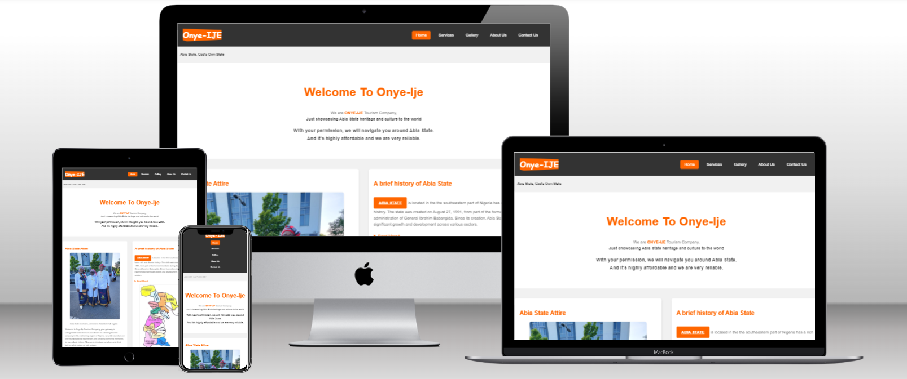

# **Welcome to Onye-Ije Tourism Company**

The link can be found here - [Onye-Ije Tourism Company](https://onyeami.github.io/tourismabia/)

(Developer: Charles Onye)

## Introduction

Welcome to Onye-Ije Tourism Company. Onye Ije means ‘the traveller’ in the Igbo language. Our main purpose is to provide you with all the information and resources you need in order to plan your unforgettable trip to Abia State in Nigeria. Onye-Ije Tourism Company has the primary objective of showcasing to the world the beauty and cultural heritage of Abia State in the southeastern part of Nigeria. This README provides an overview of our company and the amazing experience you can enjoy while exploring Abia State.

## Table of Contents

## User Experience

- ## Target Audience

1. Tourists and Travellers

    Local and international tourists seeking unique travel experiences.
    Adventure seekers looking to explore the natural wonders of Abia State.
    Cultural enthusiasts interested in learning about the rich heritage of the region.

2. Event Planners

    Individuals or organizations looking to host events, conferences, weddings, or special celebrations in Abia State.

3. Accommodation Seekers

    Travellers in need of information and assistance with booking accommodations in Abia State, including hotels, lodges, and vacation rentals.

4. Food Enthusiasts

    Food lovers interested in experiencing and savoring the local cuisine of Abia State.

5. Transportation Seekers

    Travellers in need of transportation services, including car rentals, and local transportation arrangements.

6. Cultural and Art Enthusiasts

    Individuals interested in exploring the cultural and artistic aspects of Abia State, including visits to traditional villages and art exhibitions.

7. Travel Agencies and Tour Operators

    Other tourism-related businesses and agencies looking to collaborate or partner with Abia State Tourism Company to offer comprehensive travel packages.

## About Abia State

Abia State is located in the south-eastern part of Nigeria and is known for its rich history, captivating landscapes, vibrant culture and warm hospitality. Abia State offers a unique blend of natural wonders. Historical sites and traditional customs that will leave you awe-inspired.

## First Time Users Of The Onye-Ije Tourism Company Website

1. Information Gathering

    First-time users often visit the website to gather essential information about Abia State as a tourism destination. They may want to learn about the state's attractions, culture, climate, and local customs.

2. Exploration

    Many users want to explore the various services and offerings provided by the Onye-Ije Tourism Company. They might be interested in guided tours, accommodations, cultural experiences, or event planning services.

3. Booking Services

    Some users may be ready to take action and book their trip. They may want to check availability, pricing, and make reservations for tours, accommodations, or events directly through the website.

4. Contacting the Company

    First-time users might need to reach out to the company for specific inquiries or custom requests. They may be looking for contact information or inquiry forms.

5. Understanding Local Cuisine and Culture

    Users interested in the local culture and cuisine might be seeking information on food tours, cultural experiences, and opportunities to engage with the traditions and art of Abia State.

6. Transportation and Logistics

    Those planning a trip might be looking for information on transportation services, including airport transfers, car rentals, and local transportation options.

7. Getting Inspired

    Some users might not have a specific plan but are looking to be inspired. They may want to explore images, stories, and testimonials to get a sense of what Onye-Ije Tourism Company has to offer.

## Frequent Users Of The Onye-Ije Tourism Company Website

1. Booking and Reservations

    Frequent users may return to the website to make additional bookings for upcoming trips, tours, accommodations, or events. This group values the convenience of online reservations.

2. Checking for Updates and Promotions

    Frequent users often check the website for updates on new tours, special promotions, discounts, or seasonal events. They want to stay informed about the latest offerings.

3. Seeking Customized Services

    Frequent users may have more specific or tailored needs. They might return to request customized tours, unique event planning, or specialized services based on their preferences.

4. Exploring Deeper Content

    Frequent users may go beyond basic information and delve into more in-depth content about the culture, history, and traditions of Abia State.

5. Providing Feedback

    Returning visitors may want to leave reviews, feedback, or testimonials based on their previous experiences with the company's services.

6. Referring Friends and Family

    Satisfied frequent users may recommend the website and services to friends and family, so they may look for easy ways to refer others or share content.

7. Research for Repeat Visits

    Frequent users planning to visit Abia State multiple times might use the website to research new places to explore on their return visits.

## Why choose Onye-Ije Tourism Company?

At Onye-Ije Tourism Company, we are very passionate about creating unforgettable experiences for our visitors. As a first-time visitor, we understand that you may be seeking clarity on what our website offers. Our goal is to showcase various destinations, attractions, and activities to inspire your visit to Abia State. Whether you are looking for adventure, relaxation, cultural experiences, or simply a fun getaway, our website is here to guide you.

## The Objectives Of The Onye-Ije Tourism Company Website

- The Onye-Ije Tourism Company website caters the need of the users by
  providing a user-friendly interface for managing bookings, offering loyalty programs or rewards, and delivering personalized content and recommendations based on the user's past interactions with the site.
  
- It should encourage engagement and facilitate communication with the
  company.
  
- The Onye-Ije Tourism Company website provides a user-friendly experience
  that guides visitors to the information and services they need. This could include clear navigation, well-structured content, easy access to contact details, and a visually appealing presentation of Abia State's attractions and offerings.

## The Design of the Website

- The colour scheme used is orange and white.

- The typography used is Arial font, being the main font and sans serif as the fall-back font.

- The features are interactive elements and are responsive on all device sizes.

- The technologies used are HTML and CSS.

- The frameworks, libraries and programs used are

  - Hover.css used on the social media icons in the footer to add the float transition while being hovered over
  - Git used for version control by utilizing the Gitpod terminal to commit to Git and Push to GitHub.
  - GitHub used to store the project’s code after being pushed from Git.

## The Website Structure

  1. _Home Page_

     - Eye-catching header showing the name of the tourist company ‘Onye-Ije Tourism Company’
     - Welcome message highlighting the uniqueness and beauty of Abia State.
     - A brief overview of the website and its purpose.
     - The navigation menu to access different sections of the website.

  2. _About Us_

     - Information about Abia State, its location, and significance.
     - History of the state and its cultural heritage.
     - Key facts and figures about Abia State
     - Map highlighting major cities and landmarks.

  3. _Gallery_

     - Categories of tourist attractions (e.g., Natural Wonders, Cultural Sites, Historical Landmarks, Adventure Activities)
     - List of popular tourist attractions under each category
     - Brief descriptions, images, and highlights of each attraction
     - Links to detailed pages for each attraction with additional information

  4. _Services_

     - Travel tips and guidelines for visiting Abia State
     - Information on transportation options within the state
     - Accommodation options (hotels, resorts, guest houses) with descriptions and contact details
     - Weather information and the best time to visit

  5. _Events and Festivals_

     - Calendar of upcoming events, festivals, and cultural celebrations in Abia State
       \*Detailed descriptions of major events with dates, locations, and highlights
     - Photo gallery showcasing previous events and festivals

  6. _Local Cuisine_

     - Introduction to the diverse culinary traditions of Abia State
     - Featured local dishes with descriptions and images

  7. _Testimonies_

     - Personal accounts from visitors sharing their adventures in the state
     - Opportunities for visitors to contribute their own stories and photos

  8. _Contact Us_

     - Contact form for general inquiries, feedback, and partnership opportunities
     - Contact details for Onye-Ije Tourism Company.
     - Office address and phone numbers for direct communication.

  9. _Footer_
     - Social media links to connect with Onye-Ije Tourism's official accounts
